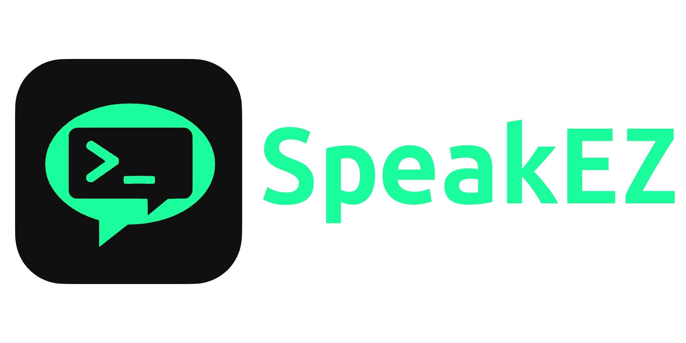

<p align="center">
  
  <br/>
  
  
  
</p>

---

# SpeakEZ

SpeakEZ is an open-source IRC client in your terminal written in Rust with the Ratatui crate for visuals. SpeakEZ is a minimal client that implements just enough protocol from scratch to support single channel chatting and private messages. No extra config files, tiling, tabs, splits, or menus. SpeakEZ is focused on being performant and simple.

---

## Compiling/Installation

```
git clone https://github.com/lancebord/speakez.git
cd speakez
cargo install --path .
```

## Usage

```
speakez -s <server_addr>:<port> -n <nick>
```

You can optionally set username, realname, and password with `-u`, `-r`, and `-p` respectively.

Once connected join a channel with `/join #<channel>`

## Commands

- `/join #<channel>` - joins the named channel and leaves prior channel
- `/part` - leaves the current channel
- `/nick <new_nick>` - changes nick to the new nick
- `/quit` - quits the client
- `/me` - return info about current user
- `/msg <nick> <message>` - sends a private message to specified nick

## Thanks & Inspiration

- [modern irc client protocol](https://modern.ircdocs.horse/)
